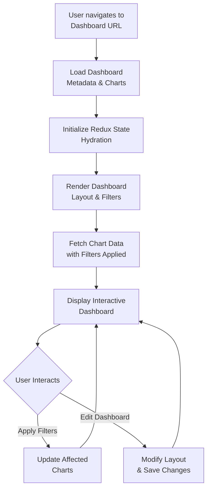
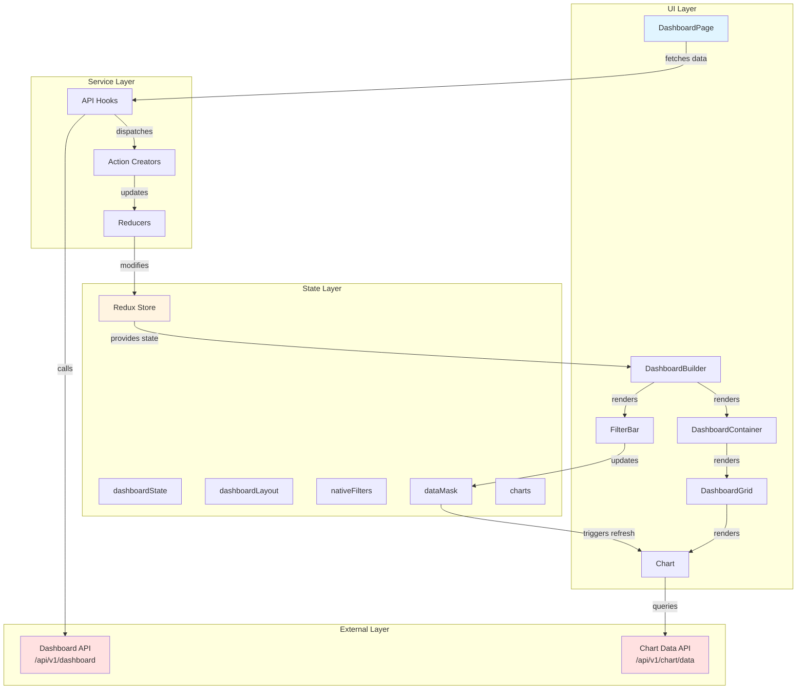
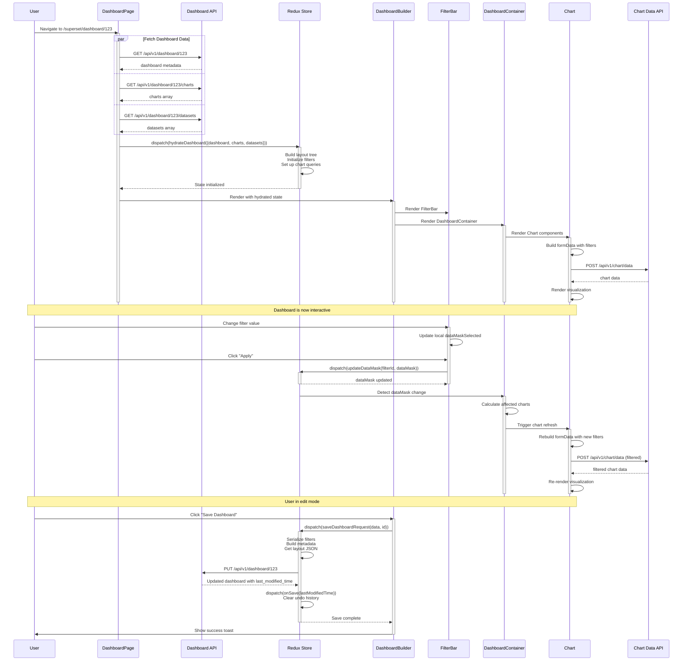

# Lifecycle: Creating and Viewing Interactive Dashboards

**Use Case**: Creating and Viewing Interactive Dashboards
**User Story**: As a business analyst, I want to compose multiple visualizations into interactive dashboards with filters, tabs, and layouts to monitor business metrics and KPIs.

---

## Layer 1: User Journey (High-Level Flow)



---

## Layer 2: Component Architecture



### Component Implementation Mapping

| Component | Implementation | File:Line | Purpose |
|-----------|---------------|-----------|---------|
| **UI Layer** |
| DashboardPage | `DashboardPage` | [DashboardPage.tsx:111-269](superset-frontend/src/dashboard/containers/DashboardPage.tsx#L111-L269) | Entry point, orchestrates data loading |
| DashboardBuilder | `DashboardBuilder` | [DashboardBuilder.tsx:373-724](superset-frontend/src/dashboard/components/DashboardBuilder/DashboardBuilder.tsx#L373-L724) | Layout orchestrator, renders header/filters/content |
| FilterBar | `FilterBar` | [index.tsx:132-334](superset-frontend/src/dashboard/components/nativeFilters/FilterBar/index.tsx#L132-L334) | Native filters panel with Apply/Clear |
| DashboardContainer | `DashboardContainer` | [DashboardContainer.tsx:105-319](superset-frontend/src/dashboard/components/DashboardBuilder/DashboardContainer.tsx#L105-L319) | Grid container with color management |
| DashboardGrid | `DashboardGrid` | [DashboardGrid.jsx](superset-frontend/src/dashboard/containers/DashboardGrid.jsx) | Maps layout components to React components |
| Chart | `Chart` | [Chart.jsx:107-561](superset-frontend/src/dashboard/components/gridComponents/Chart.jsx#L107-L561) | Individual chart with interactions |
| **State Layer** |
| Redux Store | `RootState` | [types.ts](superset-frontend/src/dashboard/types.ts) | Root state interface |
| dashboardState | `dashboardStateReducer` | [dashboardState.js:56-275](superset-frontend/src/dashboard/reducers/dashboardState.js#L56-L275) | UI state, edit mode, tabs |
| dashboardLayout | `undoable(dashboardLayoutReducer)` | [dashboardLayout.js](superset-frontend/src/dashboard/reducers/dashboardLayout.js) | Component tree with undo/redo |
| nativeFilters | `nativeFiltersReducer` | [nativeFilters.ts](superset-frontend/src/dashboard/reducers/nativeFilters.ts) | Filter configurations |
| dataMask | `dataMaskReducer` | [reducer.ts](superset-frontend/src/dataMask/reducer.ts) | Current filter values |
| charts | `chartsReducer` | [chartReducers.ts](superset-frontend/src/components/Chart/chartReducers.ts) | Chart query results |
| **Service Layer** |
| API Hooks | `useDashboard`<br/>`useDashboardCharts`<br/>`useDashboardDatasets` | [DashboardPage.tsx:121-129](superset-frontend/src/dashboard/containers/DashboardPage.tsx#L121-L129) | React hooks for API fetching |
| Action Creators | `hydrateDashboard`<br/>`saveDashboardRequest`<br/>`updateDataMask` | [hydrate.js:58-316](superset-frontend/src/dashboard/actions/hydrate.js#L58-L316)<br/>[dashboardState.js:270-531](superset-frontend/src/dashboard/actions/dashboardState.js#L270-L531) | Redux action creators |
| **External Layer** |
| Dashboard API | `DashboardRestApi.get()`<br/>`DashboardRestApi.put()` | [api.py:331-376](superset/dashboards/api.py#L331-L376)<br/>[api.py:597-682](superset/dashboards/api.py#L597-L682) | Dashboard CRUD operations |
| Chart Data API | `ChartRestApi.post_data()` | [api.py](superset/charts/api.py) | Chart query execution |

---

## Layer 3: Detailed Interaction Flow



### Key Design Patterns

1. **Redux State Management Pattern**
   - Single source of truth for dashboard state
   - Unidirectional data flow: User Action → Action Creator → Reducer → State → UI
   - Undo/redo support via `redux-undo` wrapper on layout reducer
   - Normalized state shape (entities stored by ID in objects, not arrays)

2. **Container/Presenter Pattern**
   - Container components (e.g., `DashboardPage`, `Dashboard`) connect to Redux
   - Presenter components (e.g., `DashboardBuilder`, `Chart`) receive props
   - Separation of data fetching logic from presentation logic

3. **Optimistic UI Updates with Local State**
   - FilterBar maintains local `dataMaskSelected` state for immediate feedback
   - Only syncs to Redux on "Apply" or for instant filters
   - Reduces Redux dispatches and improves performance

---

## Data Structures

### Dashboard Metadata
```typescript
// Dashboard info stored in Redux
interface DashboardInfo {
  id: number;
  dashboard_title: string;
  slug: string | null;
  owners: Owner[];
  roles: Role[];
  metadata: {
    color_scheme: string;            // e.g., "supersetColors"
    color_scheme_domain: string[];   // Custom color palette
    label_colors: Record<string, string>;
    shared_label_colors: Record<string, string>;
    cross_filters_enabled: boolean;  // Enable chart-to-chart filtering
    positions?: Record<string, LayoutItem>; // Deprecated, use position_json
    refresh_frequency?: number;      // Auto-refresh interval in seconds
    timed_refresh_immune_slices?: number[]; // Charts excluded from auto-refresh
    filter_scopes?: Record<string, FilterScope>; // Legacy filter scopes
    expanded_slices?: Record<number, boolean>; // Expanded chart states
  };
  position_json: Record<string, LayoutItem>; // Component layout
  css: string;                       // Custom CSS
  json_metadata: string;             // Serialized metadata
  published: boolean;
  common: {
    conf: {
      DASHBOARD_AUTO_REFRESH_INTERVALS: number[][];
      SUPERSET_WEBSERVER_TIMEOUT: number;
    };
  };
}
```

### Dashboard Layout
```typescript
// Layout structure stored in dashboardLayout.present
type DashboardLayout = Record<string, LayoutItem>;

interface LayoutItem {
  id: string;                     // Component ID (e.g., "GRID_ID", "TAB-abc", "CHART-123")
  type: ComponentType;            // "GRID" | "TABS" | "TAB" | "ROW" | "COLUMN" | "CHART" | etc.
  children: string[];             // Array of child component IDs
  parents?: string[];             // Array of parent component IDs
  meta: {
    width?: number;               // Grid width (1-12)
    height?: number;              // Grid height
    chartId?: number;             // For CHART type: slice ID
    sliceName?: string;           // For CHART type: chart name
    sliceNameOverride?: string;   // Custom chart title
    uuid?: string;                // Unique identifier for referencing
    // ... additional metadata per component type
  };
}

type ComponentType =
  | "CHART"
  | "COLUMN"
  | "DIVIDER"
  | "GRID"
  | "HEADER"
  | "MARKDOWN"
  | "ROW"
  | "TABS"
  | "TAB";
```

### Native Filter Configuration
```typescript
// Stored in nativeFilters state
interface NativeFiltersState {
  filters: Record<string, Filter>;        // Filter configurations by ID
  focusedFilterId?: string;               // Currently focused filter
  hoveredFilterId?: string;               // Currently hovered filter
  filtersState?: Record<string, any>;     // Additional filter state
}

interface Filter {
  id: string;                             // Unique filter ID
  name: string;                           // Display name
  filterType: string;                     // "filter_select" | "filter_range" | etc.
  targets: FilterTarget[];                // Which columns to filter
  defaultDataMask?: DataMask;             // Default filter values
  cascadeParentIds?: string[];            // Cascading filter dependencies
  scope: FilterScope;                     // Which charts are affected
  controlValues: {
    enableEmptyFilter?: boolean;
    multiSelect?: boolean;
    searchAllOptions?: boolean;
    inverseSelection?: boolean;
    // ... filter-type-specific controls
  };
  chartsInScope?: number[];               // Cached list of affected chart IDs
  tabsInScope?: string[];                 // Cached list of affected tab IDs
}

interface FilterTarget {
  datasetId: number;                      // Target dataset ID
  column: {
    name: string;                         // Column name to filter
  };
}

interface FilterScope {
  rootPath: string[];                     // Root component path
  excluded: number[];                     // Excluded chart IDs
}
```

### Data Mask (Filter Values)
```typescript
// Stored in dataMask state
type DataMaskState = Record<string, DataMask>;

interface DataMask {
  id: string;                             // Filter ID
  currentState?: {
    label?: string;                       // Selected label (for display)
    value?: any;                          // Selected value(s)
  };
  filterState?: {
    label?: string;
    value?: any;
    validateStatus?: boolean;
    validateMessage?: string;
  };
  extraFormData?: {                       // Applied to chart queries
    filters?: Filter[];                   // Adhoc filters
    time_range?: string;                  // Time range override
    append_form_data?: Record<string, any>;
    override_form_data?: Record<string, any>;
  };
  ownState?: Record<string, any>;         // Chart-specific state
}

interface AdhocFilter {
  clause: "WHERE" | "HAVING";
  subject: string;                        // Column name
  operator: string;                       // "==" | "IN" | ">" | etc.
  comparator: any;                        // Value to compare
  expressionType: "SIMPLE" | "SQL";
}
```

### Chart Form Data
```typescript
// Query configuration for charts
interface QueryFormData {
  datasource: string;                     // "${datasetId}__table"
  viz_type: string;                       // "table" | "line" | "bar" | etc.
  slice_id?: number;                      // Chart ID

  // Time configuration
  time_range?: string;                    // "Last week" | "2024-01-01 : 2024-01-31"
  time_grain_sqla?: string;               // "P1D" (daily) | "P1W" (weekly) | etc.
  granularity_sqla?: string;              // Time column name

  // Metrics and dimensions
  metrics?: string[] | Metric[];          // Aggregations to compute
  groupby?: string[];                     // Dimensions to group by
  columns?: string[];                     // Columns to display

  // Filters
  adhoc_filters?: AdhocFilter[];          // User-defined filters
  extra_filters?: ExtraFilter[];          // Dashboard filters (legacy)
  extra_form_data?: ExtraFormData;        // Native filter overrides

  // Chart-specific options
  row_limit?: number;                     // Max rows to return
  order_desc?: boolean;                   // Sort order
  color_scheme?: string;                  // Color palette

  // ... 100+ additional viz-specific parameters
}

interface Metric {
  label: string;
  expressionType: "SIMPLE" | "SQL";
  sqlExpression?: string;
  aggregate?: string;                     // "SUM" | "COUNT" | "AVG" | etc.
  column?: {
    column_name: string;
  };
}
```

---

## Quick Reference

### Event Triggers

| Event | Trigger | Effect |
|-------|---------|--------|
| **Page Load** | User navigates to dashboard URL | Fetch dashboard data → hydrate Redux → render UI |
| **Filter Change** | User modifies filter in FilterBar | Update local state (instant feedback) |
| **Filter Apply** | User clicks "Apply" button | Dispatch `updateDataMask()` → refresh affected charts |
| **Chart Interaction** | User clicks "Refresh" on chart | Dispatch `triggerQuery(chartId)` → re-fetch chart data |
| **Edit Mode** | User clicks "Edit dashboard" | Set `editMode: true` → show edit UI (resize handles, add buttons) |
| **Save Dashboard** | User clicks "Save" | Serialize state → PUT `/api/v1/dashboard/<id>` → update Redux |
| **Tab Switch** | User clicks tab | Update `activeTabs` → hide/show relevant grids |
| **Auto-Refresh** | Timer interval expires | Dispatch `onRefresh()` → refresh all charts (except immune) |

### Data Formats

**Dashboard Position JSON** (stored in `position_json` field):
```json
{
  "GRID_ID": {
    "type": "GRID",
    "id": "GRID_ID",
    "children": ["ROW-abc123"],
    "parents": ["ROOT_ID"]
  },
  "ROW-abc123": {
    "type": "ROW",
    "id": "ROW-abc123",
    "children": ["CHART-456"],
    "parents": ["GRID_ID"],
    "meta": { "background": "BACKGROUND_TRANSPARENT" }
  },
  "CHART-456": {
    "type": "CHART",
    "id": "CHART-456",
    "children": [],
    "parents": ["ROW-abc123"],
    "meta": {
      "chartId": 456,
      "width": 6,
      "height": 50,
      "sliceName": "Revenue Over Time"
    }
  }
}
```

**Native Filter Key Payload** (stored in backend for URL sharing):
```json
{
  "dataMask": {
    "FILTER-abc": {
      "filterState": {
        "value": ["Product A", "Product B"]
      },
      "extraFormData": {
        "filters": [{
          "col": "product_name",
          "op": "IN",
          "val": ["Product A", "Product B"]
        }]
      }
    }
  },
  "anchor": "#some-anchor"
}
```

### Error Handling

| Error Scenario | Handling |
|----------------|----------|
| **Dashboard not found** | API returns 404 → Show error message in DashboardPage |
| **Permission denied** | API returns 403 → Show "Access Denied" message |
| **Chart query timeout** | ChartContainer shows timeout error → User can retry |
| **Save conflict** | Backend returns 409 → Show `OverwriteConfirm` modal with diff |
| **Invalid filter config** | Validation error → Show inline error in FilterBar |
| **Network failure** | Toast notification → User can retry operation |

### Performance Optimizations

- **Chart Data Caching**: Results cached in backend (Redis/Memcached) with configurable TTL
- **Metadata Caching**: Dashboard metadata cached to reduce DB queries
- **Lazy Chart Loading**: Charts fetch data on mount, not all at once
- **Debounced Filter Publishing**: URL updates debounced by 500ms to reduce backend calls
- **Memoized Selectors**: Redux selectors use `reselect` to prevent unnecessary re-renders
- **Color Sync Optimization**: DashboardContainer tracks rendered charts to apply colors only once

---

## Related Lifecycles

1. **[002] Exploring Data and Building Visualizations (Explore View)**
   - Chart creation flow that produces charts used in dashboards
   - Dataset selection and query building
   - Chart type selection and control panel configuration

2. **[003] Writing and Executing SQL Queries (SQL Lab)**
   - Create custom datasets from SQL queries
   - Export query results for visualization
   - Save queries that become dashboard data sources

3. **[004] Managing Data Connections and Datasets**
   - Database connection setup that powers dashboard data
   - Dataset configuration with metrics and columns
   - Dataset-level caching that affects dashboard performance

4. **[005] Scheduling Reports and Alerts**
   - Schedule dashboard screenshots via email/Slack
   - Set up alerts based on dashboard chart thresholds
   - Configure cron schedules for recurring reports

5. **[008] Embedding Superset in Applications**
   - Embed dashboards in external apps using guest tokens
   - Configure RLS rules for embedded dashboards
   - Use iframe-based embedding with SDK

---

## Component Overview

### Key Components and Their Roles

| Component | Type | Responsibilities |
|-----------|------|------------------|
| **DashboardPage** | Container | Entry point, data fetching orchestration, hydration trigger |
| **Dashboard** | Container | Filter lifecycle manager, chart refresh coordinator, layout change detector |
| **DashboardBuilder** | Presenter | Layout orchestrator, renders header/filters/content areas |
| **DashboardContainer** | Container | Grid container, tab navigation, color scheme synchronization |
| **DashboardGrid** | Presenter | Maps layout tree to React components recursively |
| **Chart** | Container | Individual chart lifecycle, form data construction, chart interactions |
| **FilterBar** | Container | Filter panel UI, local state management, Apply/Clear logic |
| **FilterControls** | Presenter | Renders individual filter inputs (select, range, time, etc.) |
| **ChartContainer** | Container | Chart query execution, loading states, error handling |
| **SliceHeader** | Presenter | Chart header with controls (refresh, explore, export, etc.) |

### Key Services

| Service | Location | Purpose |
|---------|----------|---------|
| **Dashboard API** | `superset/dashboards/api.py` | CRUD operations for dashboards |
| **Chart Data API** | `superset/charts/api.py` | Execute chart queries with filters |
| **Filter State API** | `superset/dashboards/filter_state/api.py` | Persist filter state for URL sharing |
| **hydrateDashboard** | `dashboard/actions/hydrate.js` | Initialize Redux state from API data |
| **saveDashboardRequest** | `dashboard/actions/dashboardState.js` | Serialize and save dashboard changes |
| **updateDataMask** | `dataMask/actions.ts` | Update filter values in Redux |
| **getFormDataWithExtraFilters** | `dashboard/util/getFormDataWithExtraFilters.ts` | Merge chart config with dashboard filters |

---

**File Generated**: `memory/system/001_lifecycle_creating_viewing_dashboards.md`
**Last Updated**: 2025-10-12
**Superset Version**: master branch (as of 2025-10-12)
