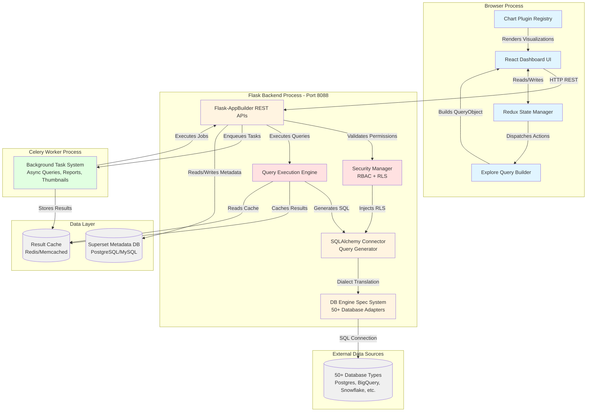

# Apache Superset System Architecture

**Purpose**: High-level map of major heavyweight components where significant logic lives
**Audience**: Developers onboarding to understand the system's major actors and data flow
**Last Updated**: 2025-10-12

---

## 1. System Overview Diagram



---

## 2. Component Catalog

### **Frontend - Browser Process**

| Component | Technology | Primary Responsibility | Key Files | Heavy Logic |
|-----------|-----------|------------------------|-----------|-------------|
| **Redux State Manager** | Redux + Redux Toolkit + TypeScript | Centralized state management for dashboards, charts, SQL Lab, explore views | [dashboard/actions/](superset-frontend/src/dashboard/actions/)<br/>[SqlLab/actions/sqlLab.js:1-1347](superset-frontend/src/SqlLab/actions/sqlLab.js#L1-L1347)<br/>[explore/actions/exploreActions.ts](superset-frontend/src/explore/actions/exploreActions.ts) | - Filter propagation across dashboard charts (~500 LOC)<br/>- SQL Lab query execution lifecycle (~1,347 LOC)<br/>- Dashboard layout undo/redo with redux-undo<br/>- Normalized state shape with selectors |
| **Chart Plugin Registry** | React + TypeScript + Lerna Monorepo | Plugin-based visualization system with 30+ chart types | [@superset-ui/core](superset-frontend/packages/@superset-ui/core/)<br/>[plugins/](superset-frontend/plugins/)<br/>598+ TypeScript files | - `buildQuery()`: Converts UI controls to QueryObject<br/>- `transformProps()`: Data transformation for viz<br/>- Plugin lifecycle management<br/>- Control panel configuration DSL |
| **Explore Query Builder** | React + Ant Design + Redux | Interactive chart builder that converts UI to query specifications | [explore/](superset-frontend/src/explore/)<br/>100+ component files<br/>[exploreActions.ts](superset-frontend/src/explore/actions/exploreActions.ts) | - Metric/column selector with adhoc expressions<br/>- Time range parser (relative/absolute)<br/>- Adhoc filter builder (visual SQL)<br/>- Query validation and preview |
| **React Dashboard UI** | React + Emotion + TypeScript | Dashboard rendering, layout management, filter UI | [dashboard/](superset-frontend/src/dashboard/)<br/>[DashboardBuilder.tsx:373-724](superset-frontend/src/dashboard/components/DashboardBuilder/DashboardBuilder.tsx#L373-L724)<br/>[FilterBar/index.tsx:132-334](superset-frontend/src/dashboard/components/nativeFilters/FilterBar/index.tsx#L132-L334) | - Native filter scope calculation<br/>- Drag-and-drop layout editor<br/>- Cross-chart filtering coordination<br/>- Color scheme synchronization |

---

### **Backend - Flask Process (Port 8088)**

| Component | Technology | Primary Responsibility | Key Files | Heavy Logic |
|-----------|-----------|------------------------|-----------|-------------|
| **DB Engine Spec System** | SQLAlchemy + 50+ DB Drivers | Database dialect abstraction for heterogeneous data sources | [db_engine_specs/base.py:1-2538](superset/db_engine_specs/base.py#L1-L2538)<br/>50+ engine specs (BigQuery, Snowflake, Postgres, etc.) | - SQL dialect translation (LIMIT vs TOP clauses)<br/>- Time grain expressions (date truncation per DB)<br/>- Column type normalization<br/>- OAuth2 authentication flows<br/>- Query cost estimation<br/>- Error message extraction |
| **Security Manager** | Flask-AppBuilder + JWT | RBAC, RLS, permissions, guest tokens for embedding | [security/manager.py:1-2749](superset/security/manager.py#L1-L2749) | - Row-Level Security filter injection<br/>- Dataset/database permission checks<br/>- Guest token generation/validation<br/>- User impersonation authorization<br/>- Permission sync across datasources<br/>- SQL injection prevention |
| **Query Execution Engine** | SQLAlchemy + Celery + MessagePack | SQL execution, result serialization, caching | [sql_lab.py:1-715](superset/sql_lab.py#L1-L715)<br/>[common/query_context_processor.py:1-919](superset/common/query_context_processor.py#L1-L919) | - Async query execution via Celery<br/>- Multi-statement SQL parsing<br/>- CTAS operations<br/>- Result compression (zlib)<br/>- MessagePack/Arrow serialization<br/>- Query timeout management<br/>- Post-processing pipeline (pivot, rolling windows) |
| **SQLAlchemy Connector** | SQLAlchemy + Jinja2 + Pandas | Converts QueryObject to SQL SELECT statements | [connectors/sqla/models.py:1-2131](superset/connectors/sqla/models.py#L1-L2131) | - QueryObject to SQLAlchemy translation (~500 LOC)<br/>- Jinja template processing for dynamic SQL<br/>- Adhoc metric/column to SQL conversion<br/>- Series limiting with pre-queries<br/>- CTE generation for complex queries<br/>- RLS filter application |
| **Flask-AppBuilder APIs** | Flask + Marshmallow + OpenAPI | RESTful CRUD APIs for all resources | [dashboards/api.py:331-376](superset/dashboards/api.py#L331-L376)<br/>[charts/api.py:1-1153](superset/charts/api.py#L1-L1153)<br/>[databases/api.py](superset/databases/api.py) | - Request validation (Marshmallow schemas)<br/>- Permission checking per endpoint<br/>- Filtering, sorting, pagination<br/>- Export/import functionality<br/>- OpenAPI spec generation |

---

### **Background - Celery Worker Process**

| Component | Technology | Primary Responsibility | Key Files | Heavy Logic |
|-----------|-----------|------------------------|-----------|-------------|
| **Background Task System** | Celery + Redis + Selenium/Playwright | Async queries, scheduled reports, thumbnails, cache warming | [tasks/async_queries.py](superset/tasks/async_queries.py)<br/>[tasks/thumbnails.py](superset/tasks/thumbnails.py)<br/>[tasks/scheduler.py](superset/tasks/scheduler.py)<br/>[tasks/cache.py](superset/tasks/cache.py) | - Long-running query execution<br/>- Screenshot capture for dashboards<br/>- Email/Slack notifications<br/>- Cron-based report scheduling<br/>- Cache pre-warming strategies<br/>- Result backend storage (Redis/S3) |

---

### **Data Layer**

| Component | Technology | Primary Responsibility | Key Files | Heavy Logic |
|-----------|-----------|------------------------|-----------|-------------|
| **Superset Metadata DB** | PostgreSQL/MySQL + SQLAlchemy ORM | Stores dashboards, charts, datasets, users, permissions | [models/core.py:1-1230](superset/models/core.py#L1-L1230)<br/>[models/dashboard.py](superset/models/dashboard.py)<br/>[models/slice.py](superset/models/slice.py) | - Alembic migrations<br/>- Database connection pooling<br/>- SSH tunneling for connections<br/>- Connection parameter encryption<br/>- Relationship management |
| **Result Cache** | Redis/Memcached/Filesystem | Caches chart query results and thumbnails | [utils/cache_manager.py](superset/utils/cache_manager.py) | - Cache key generation (includes user context)<br/>- TTL management<br/>- Cache invalidation strategies<br/>- Multi-tier caching (metadata, data, thumbnails) |

---

### **External Layer**

| Component | Technology | Primary Responsibility | Key Files | Heavy Logic |
|-----------|-----------|------------------------|-----------|-------------|
| **Data Sources (50+)** | Various: PostgreSQL, BigQuery, Snowflake, MySQL, Redshift, Presto, Trino, etc. | Stores business data queried by Superset | N/A (external systems) | Superset connects read-only (typically)<br/>Handles 50+ different SQL dialects |

---

## 3. Technology Stack

### UI Layer
- **Core**: React 18, TypeScript, Emotion (CSS-in-JS)
- **State**: Redux, Redux Toolkit, redux-undo, Reselect
- **UI Components**: Ant Design, custom component library
- **Visualizations**: ECharts, deck.gl, D3.js
- **Build**: Webpack, Babel, npm

### State/Logic Layer (Frontend)
- **Data Fetching**: Custom hooks, fetch API
- **Form Management**: Ant Design Form
- **Routing**: React Router
- **Testing**: Jest, React Testing Library, Cypress (E2E)

### Service/API Layer (Backend)
- **Web Framework**: Flask 2.x
- **REST API**: Flask-AppBuilder (extends Flask-RESTX)
- **Authentication**: Flask-Login, Flask-JWT-Extended
- **ORM**: SQLAlchemy 1.4
- **Validation**: Marshmallow 3.x
- **Background Jobs**: Celery 5.x
- **Message Broker**: Redis
- **Template Engine**: Jinja2

### Data Layer
- **Metadata Storage**: PostgreSQL, MySQL, SQLite
- **Result Cache**: Redis, Memcached, Filesystem
- **Result Backend**: Redis, S3, GCS (for Celery)
- **Serialization**: MessagePack, Apache Arrow (IPC), JSON
- **Data Processing**: Pandas, NumPy

### External Dependencies
- **Database Drivers**: 50+ SQLAlchemy drivers (psycopg2, pymysql, BigQuery, Snowflake connectors, etc.)
- **Screenshot Tools**: Selenium, Playwright (ChromeDriver)
- **Notifications**: SMTP, Slack SDK
- **File Storage**: S3, GCS, Azure Blob (optional)
- **SSH Tunneling**: Paramiko

---

## 4. Integration Points

### Frontend ↔ Backend

| Integration | Protocol | Data Format | Sync/Async | Example Endpoint |
|-------------|----------|-------------|------------|------------------|
| Dashboard Load | HTTP REST (GET) | JSON | Sync | `GET /api/v1/dashboard/123` |
| Chart Query | HTTP REST (POST) | JSON request → JSON response | Sync | `POST /api/v1/chart/data` |
| Dashboard Save | HTTP REST (PUT) | JSON | Sync | `PUT /api/v1/dashboard/123` |
| SQL Lab Query (short) | HTTP REST (POST) | JSON | Sync | `POST /api/v1/sqllab/execute` |
| SQL Lab Query (long) | WebSocket (optional) | JSON | Async (polling) | `POST /api/v1/sqllab/execute` → poll results |
| Filter State | HTTP REST (POST/GET) | JSON | Sync | `POST /api/v1/dashboard/123/filter_state` |

### Backend ↔ Celery Workers

| Integration | Protocol | Data Format | Sync/Async | Use Case |
|-------------|----------|-------------|------------|----------|
| Task Enqueue | Redis (Celery broker) | Pickle (Python objects) | Async | Enqueue async query |
| Task Result | Redis (result backend) | MessagePack/JSON | Async (polling) | Retrieve query results |
| Task Status | Redis | JSON | Async (polling) | Check query progress |

### Backend ↔ Data Sources

| Integration | Protocol | Data Format | Sync/Async | Use Case |
|-------------|----------|-------------|------------|----------|
| Query Execution | Database-specific (TCP) | SQL → Tabular results | Sync | Execute SELECT query |
| Metadata Fetch | Database-specific | SQL → Schema info | Sync | Sync dataset columns |
| Connection Pool | TCP Keep-alive | N/A | Persistent | Reuse connections |
| SSH Tunnel | SSH (Port 22) | Encrypted tunnel | Persistent | Connect to private DBs |

### Backend ↔ Cache

| Integration | Protocol | Data Format | Sync/Async | Use Case |
|-------------|----------|-------------|------------|----------|
| Chart Data Cache | Redis protocol | MessagePack (binary) | Sync | Cache query results |
| Metadata Cache | In-memory (Flask-Caching) | Python objects | Sync | Cache dashboard metadata |
| Thumbnail Cache | Filesystem/S3 | PNG images | Sync | Cache dashboard screenshots |

---

## 5. Where to Start

### To Understand User Interactions
- **Start with**: [001_lifecycle_creating_viewing_dashboards.md](memory/system/001_lifecycle_creating_viewing_dashboards.md)
- **Key flow**: User navigates → API fetch → Redux hydration → UI render → User filters → Chart refresh
- **Entry point**: [DashboardPage.tsx:111-269](superset-frontend/src/dashboard/containers/DashboardPage.tsx#L111-L269)

### To Understand Data Flow
- **Start with**: Query Execution Engine ([sql_lab.py:1-715](superset/sql_lab.py#L1-L715))
- **Follow path**:
  1. Frontend builds QueryObject
  2. Backend validates via Security Manager
  3. SQLAlchemy Connector generates SQL
  4. DB Engine Spec translates to dialect
  5. Query executes on data source
  6. Results serialized and cached
  7. Frontend receives and visualizes
- **Key transformation**: [connectors/sqla/models.py:1-2131](superset/connectors/sqla/models.py#L1-L2131) (`get_query_str_extended()`)

### To Understand Business Logic
- **Start with**: Security Manager ([security/manager.py:1-2749](superset/security/manager.py#L1-L2749))
- **Critical logic**:
  - Who can see what? → RBAC permission checks
  - What data can users see? → Row-Level Security injection
  - How are dashboards embedded? → Guest token generation
- **Entry point for any request**: `@with_dashboard` decorator checks permissions before API execution

### To Understand Chart Creation
- **Start with**: Explore Query Builder ([explore/](superset-frontend/src/explore/))
- **Key flow**: Select dataset → Choose viz type → Configure controls → `buildQuery()` → Preview → Save
- **Plugin system**: [packages/@superset-ui/core](superset-frontend/packages/@superset-ui/core/) - registry and interfaces
- **Backend execution**: [charts/api.py:1-1153](superset/charts/api.py#L1-L1153) - `data()` endpoint

### To Understand Database Support
- **Start with**: DB Engine Spec System ([db_engine_specs/base.py:1-2538](superset/db_engine_specs/base.py#L1-L2538))
- **Pattern**: Each database inherits from `BaseEngineSpec` and overrides ~20-50 methods
- **Examples**:
  - [db_engine_specs/bigquery.py](superset/db_engine_specs/bigquery.py) - BigQuery-specific logic
  - [db_engine_specs/snowflake.py](superset/db_engine_specs/snowflake.py) - Snowflake-specific logic
- **Key logic**: Time grain SQL generation, column type mapping, OAuth flows

### To Understand Background Jobs
- **Start with**: Celery Task System ([tasks/](superset/tasks/))
- **Key tasks**:
  - [async_queries.py](superset/tasks/async_queries.py) - Long-running query execution
  - [thumbnails.py](superset/tasks/thumbnails.py) - Screenshot generation
  - [scheduler.py](superset/tasks/scheduler.py) - Report scheduling (cron)
  - [cache.py](superset/tasks/cache.py) - Cache warming strategies

---

## 6. Deployment Architecture

### Development Mode
```
Single Machine:
- Flask dev server (port 8088) - `make flask-app`
- npm dev server (port 9000) - `npm run dev-server`
- Redis (default port 6379)
- PostgreSQL/MySQL (default ports)
```

### Production Mode (Docker Compose Example)
```
Multi-Process:
- nginx (reverse proxy, static files)
- superset-init (one-time DB migration)
- superset-app (Flask, 4+ workers via Gunicorn)
- superset-worker (Celery worker, 1+ processes)
- superset-beat (Celery scheduler, 1 process)
- redis (message broker + result backend)
- postgres/mysql (metadata database)
- (Optional) superset-websocket (async query updates)
```

### Kubernetes (Helm Chart)
```
Pods:
- Frontend: Static assets served via nginx
- Backend: Multiple Flask pods behind service
- Worker: Horizontal pod autoscaling for Celery
- Beat: Single pod for scheduler
- Redis: StatefulSet or managed service
- PostgreSQL: StatefulSet or managed service
```

---

## 7. Critical Paths

### Path 1: Dashboard Page Load (Cold Cache)
```
Browser → GET /api/v1/dashboard/123 → Flask API
  → Security Manager (permission check)
  → SQLAlchemy query (metadata DB)
  → Return JSON to browser

Browser → GET /api/v1/dashboard/123/charts → Flask API
  → SQLAlchemy query (metadata DB)
  → Return chart definitions

Browser → GET /api/v1/dashboard/123/datasets → Flask API
  → SQLAlchemy query (metadata DB)
  → Return dataset metadata

Browser → Redux hydrateDashboard() → Render UI

For each chart:
  Browser → POST /api/v1/chart/data → Flask API
    → Security Manager (RLS injection)
    → SQLAlchemy Connector (generate SQL)
    → DB Engine Spec (dialect translation)
    → Execute on data source
    → Serialize results (MessagePack)
    → Cache results (Redis)
    → Return to browser

Browser → Chart Plugin renders visualization
```

### Path 2: Apply Dashboard Filter (Hot Cache)
```
Browser → User changes filter → FilterBar updates local state
  → User clicks "Apply"
  → Redux updateDataMask() action
  → Dashboard component detects change
  → Calculate affected charts (scope logic)
  → For each affected chart:
      → Build new formData with filters
      → POST /api/v1/chart/data
      → (Same as above, may hit cache)
  → Re-render affected charts
```

### Path 3: SQL Lab Query Execution (Async)
```
Browser → User types SQL → Click "Run"
  → POST /api/v1/sqllab/execute/
  → Flask API → Security Manager (DB permission check)
  → Enqueue Celery task
  → Return task ID to browser

Celery Worker → Dequeue task
  → Execute SQL on data source
  → Serialize results (MessagePack)
  → Store in result backend (Redis/S3)
  → Mark task as complete

Browser → Polls for task status
  → GET /api/v1/sqllab/results/<task_id>
  → Retrieve results from backend
  → Display in SQL Lab results pane
```

---

## 8. Scalability Considerations

### Horizontal Scaling
- **Flask Backend**: Scale out with load balancer (stateless)
- **Celery Workers**: Scale out independently (CPU-bound)
- **Redis**: Use Redis Cluster or managed service (AWS ElastiCache)
- **PostgreSQL**: Use replicas for read-heavy workloads

### Vertical Scaling
- **Flask Backend**: Increase workers (CPU + memory)
- **Celery Workers**: Increase concurrency (CPU + memory)
- **Redis**: Increase memory for larger result cache

### Performance Bottlenecks
1. **Database Queries to Data Sources**: Optimize with indexes, materialized views
2. **Chart Data API**: Enable caching (default TTL: 1 hour)
3. **Metadata Database**: Index frequently queried columns
4. **Screenshot Generation**: Increase Celery workers, use headless Chrome

---

## 9. Security Model

### Authentication
- **Built-in**: Username/password via Flask-Login
- **OAuth**: Google, Azure AD, Okta (via Flask-AppBuilder)
- **LDAP/Active Directory**: External authentication
- **Custom**: Implement `CUSTOM_SECURITY_MANAGER`

### Authorization (RBAC)
- **Roles**: Admin, Alpha, Gamma, SQL Lab, Public
- **Permissions**: View-level (can_read, can_write), Menu access
- **Resources**: Dashboard, Chart, Database, Dataset, Query
- **Row-Level Security (RLS)**: SQL filters injected per user/role

### Data Security
- **SQL Injection**: Parameterized queries via SQLAlchemy
- **CSRF**: Flask-WTF protection
- **XSS**: React escapes content by default
- **Secrets**: Encrypted database credentials (Fernet key)

---

**File Generated**: `memory/system/SYSTEM_ARCHITECTURE.md`
**Last Updated**: 2025-10-12
**Superset Version**: master branch
